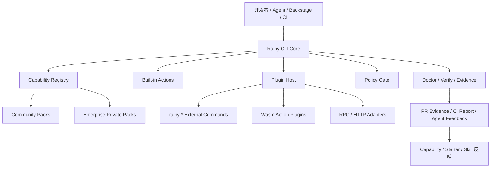
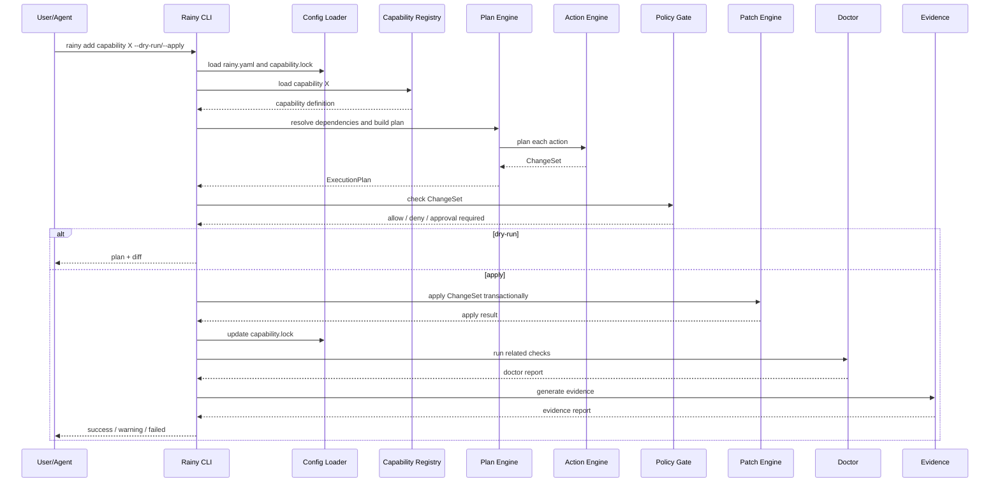
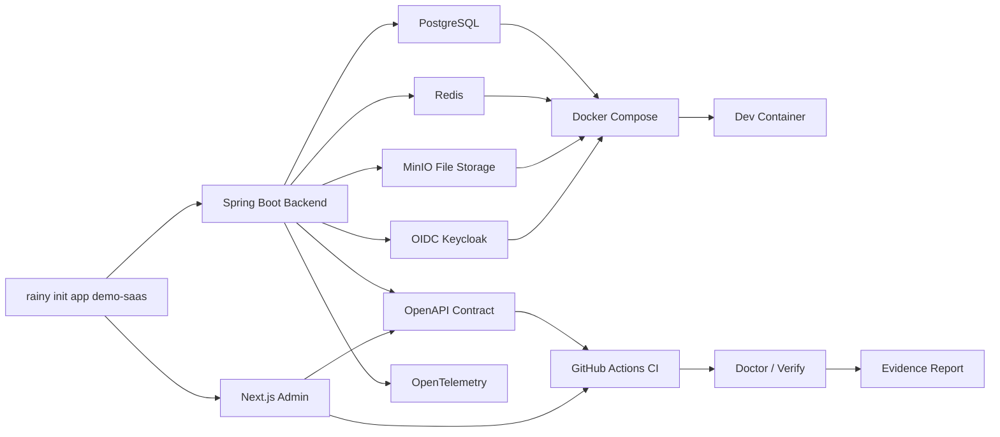
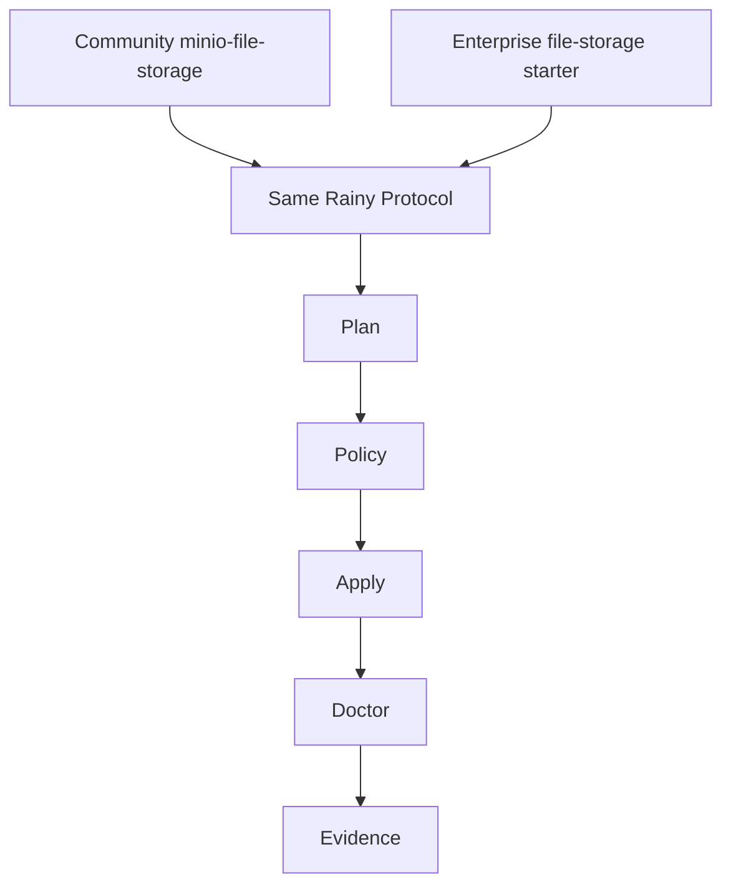

# Rainy CLI 最终形态程序设计与详细开发文档

> 版本：v1.0 设计稿  
> 定位：开源 Rust CLI 内核 + 主流研发 Golden Path + 可扩展 Capability Pack / Plugin / MCP / Backstage 集成  
> 目标读者：平台研发、后端研发、前端研发、Agent 平台研发、DevOps、架构师  
> 设计原则：**CLI 内核开源且不薄；企业能力外置接入；能力可计划、可审计、可验证、可反哺。**

---

## 0. 一句话目标

Rainy CLI 的最终形态不是一个简单脚手架，也不是企业私有 common 包的封装器，而是一个 **可扩展的软件能力编排 CLI**：

```text
需求 / Agent / Backstage / CI
        ↓
Rainy CLI Core
        ↓
Capability Pack / Plugin / Built-in Actions
        ↓
Plan → Diff → Policy → Apply → Doctor → Verify → Evidence
        ↓
项目工程、能力接入、验证报告、PR 证据、能力反哺
```

开源层必须包含一条市面常见技术栈的完整闭环：

```text
Spring Boot + Next.js + PostgreSQL + Redis + MinIO + OIDC/Keycloak
+ OpenAPI + Docker Compose + Dev Container + GitHub Actions + OpenTelemetry + Helm Draft
```

企业内部能力通过私有 Capability Pack 接入同一套机制：

```text
enterprise-web-starter
enterprise-auth-starter
enterprise-tenant-starter
enterprise-file-starter
enterprise-observability-starter
enterprise-gateway-pack
enterprise-skills
```

---

## 1. 背景与设计判断

### 1.1 已有基础

当前已经建设了依赖层 Starter，并会持续迭代。这说明企业内部已经开始把通用能力从业务项目中抽象出来，例如：

```text
web starter
security / auth starter
tenant starter
file storage starter
observability starter
data access starter
test starter
```

但 Starter 只是 Runtime 层能力，它还不能自动回答这些问题：

```text
开发者如何发现能力？
Agent 如何知道应该使用这个能力？
如何把能力接入到一个已有项目？
接入后如何验证是否正确？
能力接入失败如何沉淀为下一轮改进？
内部能力如何与开源通用能力共用一套抽象？
```

所以需要在 Starter 上面建设一层 **能力编排层**。

### 1.2 最终方案判断

推荐最终方案：

```text
开源：Rainy CLI Core + Community Golden Path + Open Protocols
私有：Enterprise Capability Packs + Enterprise Plugins + Enterprise Skills
```

也就是说：

```text
Rainy CLI Core 开源
  负责 plan / diff / apply / doctor / verify / policy / plugin / evidence

Community Packs 开源
  负责证明这套机制对主流技术栈可用，不是薄内核

Enterprise Packs 私有
  负责接入企业 starter、企业网关、企业权限、企业租户、企业业务模板
```

### 1.3 核心原则

| 原则 | 说明 |
|---|---|
| 内核稳定 | Rust CLI Core 只处理通用机制，不写死企业业务 |
| 能力外置 | 能力通过 Capability Pack 进入系统 |
| 执行确定 | CLI 不依赖模型生成核心修改，核心动作必须确定性 |
| Agent 友好 | 所有命令支持 `--json`、`--dry-run`、稳定错误码 |
| 安全优先 | 所有变更经过 Policy Gate，插件不能绕过主 CLI |
| 可验证 | 每个能力必须有 doctor / verify / e2e |
| 可反哺 | Evidence、失败报告、人工修改可沉淀为 Pack / Starter / Skill 更新 |
| 开源不薄 | 开源层必须提供主流技术栈 Golden Path |

---

## 2. 最终产品分层



### 2.1 开源层

开源层包括：

```text
rainy-cli core
rainy-json-protocol
rainy schemas
community-packs
example projects
MCP integration example
Backstage integration example
GitHub Actions integration example
conformance tests
```

### 2.2 企业私有层

企业私有层包括：

```text
enterprise capability packs
enterprise starter packs
enterprise gateway packs
enterprise skills
enterprise policy rules
enterprise agent evals
enterprise templates
enterprise plugins
```

---

## 3. 仓库最终结构

建议第一阶段使用 monorepo，方便开源用户体验完整闭环。

```text
rainy/
├── Cargo.toml
├── crates/
│   ├── rainy-cli/                 # CLI 主二进制
│   ├── rainy-core/                # 上下文、错误、公共类型
│   ├── rainy-config/              # rainy.yaml / capability.lock
│   ├── rainy-registry/            # pack / capability registry 解析
│   ├── rainy-plan/                # plan engine / dependency resolver
│   ├── rainy-actions/             # 内置 action 执行器
│   ├── rainy-patch/               # diff / patch / transactional apply
│   ├── rainy-policy/              # policy gate
│   ├── rainy-template/            # 模板渲染
│   ├── rainy-doctor/              # 项目健康检查
│   ├── rainy-verify/              # 验证执行器
│   ├── rainy-plugin/              # 插件发现和执行
│   ├── rainy-agent/               # AGENTS.md / Agent context 生成
│   ├── rainy-evidence/            # evidence report 生成
│   ├── rainy-json-protocol/       # JSON 协议类型
│   ├── rainy-conformance/         # pack/plugin 协议一致性测试
│   └── rainy-test-support/        # fixture/e2e 测试工具
│
├── schemas/
│   ├── rainy-project.schema.json
│   ├── capability-pack.schema.json
│   ├── capability.schema.json
│   ├── capability-lock.schema.json
│   ├── plan.schema.json
│   ├── changeset.schema.json
│   ├── doctor-report.schema.json
│   ├── verify-report.schema.json
│   ├── evidence.schema.json
│   └── plugin-manifest.schema.json
│
├── community-packs/
│   ├── spring-boot-web/
│   ├── nextjs-admin/
│   ├── docker-compose-local/
│   ├── minio-file-storage/
│   ├── github-actions-ci/
│   ├── postgres/
│   ├── redis/
│   ├── oidc-keycloak/
│   ├── openapi-contract/
│   ├── devcontainer/
│   ├── opentelemetry/
│   └── helm-k8s-draft/
│
├── integrations/
│   ├── mcp/
│   │   └── rainy-mcp-server/
│   ├── backstage/
│   │   ├── rainy-scaffolder-action/
│   │   └── templates/
│   └── github-action/
│       └── rainy-verify-action/
│
├── examples/
│   ├── projects/
│   │   ├── spring-nextjs-demo/
│   │   └── demo-saas-golden-path/
│   ├── packs/
│   │   └── simple-file-storage/
│   └── plugins/
│       ├── rainy-hello/
│       └── rainy-example-gateway/
│
├── docs/
│   ├── getting-started.md
│   ├── golden-path-spring-nextjs-saas.md
│   ├── architecture.md
│   ├── capability-pack-authoring.md
│   ├── action-authoring.md
│   ├── plugin-protocol.md
│   ├── doctor-and-verify.md
│   ├── mcp-integration.md
│   ├── backstage-integration.md
│   ├── enterprise-extension-guide.md
│   └── security-model.md
│
├── tests/
│   ├── fixtures/
│   ├── snapshots/
│   ├── e2e/
│   └── security/
│
└── README.md
```

企业内部可以独立维护：

```text
rainy-enterprise-packs/
├── packs/
│   ├── enterprise-spring-web/
│   ├── enterprise-auth-keycloak/
│   ├── enterprise-auth-casdoor/
│   ├── enterprise-tenant/
│   ├── enterprise-file-storage/
│   ├── enterprise-observability/
│   ├── enterprise-apisix-gateway/
│   └── enterprise-hive-graphql/
│
├── skills/
│   ├── enterprise-framework/
│   ├── file-storage/
│   ├── apisix-gateway-route/
│   └── keycloak-sso/
│
├── plugins/
│   ├── rainy-apisix/
│   ├── rainy-keycloak/
│   ├── rainy-casdoor/
│   └── rainy-hive/
│
└── evals/
    ├── add-file-storage.yaml
    ├── add-tenant-api.yaml
    └── add-gateway-route.yaml
```

---

## 4. 核心概念模型

### 4.1 Project

Rainy 管理的一个工程。可以是：

```text
spring backend
nextjs frontend
fullstack monorepo
library
service mesh config repo
platform template repo
```

项目根目录包含：

```text
rainy.yaml
capability.lock
AGENTS.md
```

### 4.2 Capability

Capability 是一个可安装、可验证、可升级的软件能力，例如：

```text
spring-boot-web
nextjs-admin
postgres
redis
minio-file-storage
oidc-keycloak
openapi-contract
enterprise-file-storage
enterprise-tenant
enterprise-apisix-route
```

### 4.3 Capability Pack

Pack 是能力包。它可以包含多个 capability、模板、validator、skills、evals。

```text
pack = capability definitions + templates + validators + skills + examples
```

### 4.4 Action

Action 是能力安装过程中的最小工程动作，例如：

```text
maven.addDependency
yaml.merge
template.render
packageJson.addDependency
dockerCompose.addService
githubActions.addWorkflow
```

### 4.5 Plan

Plan 是执行计划，是 `rainy add capability` 的中间产物。所有变更必须先进入 Plan。

### 4.6 ChangeSet

ChangeSet 是一组文件变更，包括创建、修改、删除、追加、patch。

### 4.7 Policy

Policy 决定哪些变更允许执行，哪些需要拒绝，哪些需要审批。

### 4.8 Doctor

Doctor 是健康检查。它回答：

```text
项目是否完整？
能力是否正确安装？
配置是否缺失？
生成产物是否存在？
Agent 上下文是否过期？
```

### 4.9 Verify

Verify 是更重的验证流程，会运行测试、构建、lint、docker compose config、OpenAPI diff 等。

### 4.10 Evidence

Evidence 是验证证据包，供 PR、CI、Agent、人工 review 使用。

---

## 5. CLI 命令最终设计

### 5.1 全局参数

所有命令支持：

```bash
--workspace <path>      # 指定项目目录
--json                  # 机器可读 JSON 输出
--no-color              # 关闭颜色
--trace-id <id>         # 外部传入 trace id
--verbose               # 详细日志
--quiet                 # 最少输出
```

涉及变更的命令支持：

```bash
--dry-run               # 只生成计划和 diff，不写文件
--apply                 # 正式应用变更
--output-plan <file>    # 输出 plan.json
--plan <file>           # 从 plan.json 执行
--force                 # 允许覆盖普通冲突，不允许绕过安全 policy
```

默认策略：

```text
不传 --apply 时，全部视为 dry-run。
MCP / Agent 调用时，默认 dry-run。
```

### 5.2 初始化项目

```bash
rainy init app demo-saas \
  --preset spring-nextjs \
  --package com.example.demo
```

别名：

```bash
rainy new demo-saas --golden-path spring-nextjs-saas
```

生成：

```text
demo-saas/
├── rainy.yaml
├── capability.lock
├── AGENTS.md
├── apps/
│   ├── backend/
│   └── frontend/
├── compose.yaml
├── .github/workflows/ci.yml
├── .devcontainer/
├── openapi/
├── charts/
└── evidence/
```

### 5.3 能力命令

```bash
rainy capability list
rainy capability explain file-storage
rainy capability graph
rainy capability installed
rainy capability upgrade file-storage
rainy capability remove file-storage
```

### 5.4 添加能力

```bash
rainy add capability minio-file-storage --provider minio --dry-run
rainy add capability minio-file-storage --provider minio --apply
```

企业内部：

```bash
rainy add capability enterprise-file-storage --provider minio --apply
```

### 5.5 Pack 管理

```bash
rainy pack list
rainy pack install ./community-packs/minio-file-storage
rainy pack install git+https://github.com/example/rainy-pack-postgres.git
rainy pack install git+ssh://git.internal/rainy-enterprise-packs.git
rainy pack update
rainy pack inspect enterprise-file-storage
```

### 5.6 Doctor / Verify / Evidence

```bash
rainy doctor
rainy doctor --capability minio-file-storage
rainy doctor --json

rainy verify --profile local
rainy verify --profile ci
rainy verify --capability minio-file-storage

rainy evidence generate
rainy evidence generate --format markdown
rainy evidence generate --format json
```

### 5.7 Agent 上下文

```bash
rainy agent init
rainy agent context
rainy agent context --json
rainy skill sync
```

### 5.8 插件

```bash
rainy plugin list
rainy plugin inspect apisix
rainy plugin install git+https://github.com/example/rainy-plugin-apisix.git

rainy apisix route draft
rainy oss bucket draft
```

外部命令查找：

```text
rainy apisix route draft  →  rainy-apisix route draft
rainy oss bucket draft    →  rainy-oss bucket draft
```

---

## 6. 关键配置文件设计

## 6.1 `rainy.yaml`

```yaml
apiVersion: rainy.dev/v1
kind: Project

project:
  name: demo-saas
  type: fullstack
  owner: demo-team

stack:
  backend: spring-boot
  frontend: nextjs
  gateway: none
  auth: oidc
  database: postgres
  cache: redis

paths:
  backend: apps/backend
  frontend: apps/frontend
  generated: generated
  evidence: evidence

package:
  java: com.example.demo
  npmScope: "@demo"

capabilityRegistry:
  sources:
    - type: local
      path: ./community-packs
    - type: git
      url: https://github.com/example/rainy-community-packs.git
      ref: main

policy:
  allowEdit:
    - rainy.yaml
    - capability.lock
    - AGENTS.md
    - apps/backend/src/**
    - apps/backend/pom.xml
    - apps/backend/src/main/resources/application.yml
    - apps/frontend/**
    - generated/**
    - compose.yaml
    - .github/workflows/**
    - .devcontainer/**
    - charts/**
    - openapi/**
    - evidence/**

  denyEdit:
    - "**/application-prod.yml"
    - "**/.env.production"
    - "**/secrets/**"
    - "**/*.pem"
    - "**/*.key"
    - "**/*.p12"

  requireApproval:
    - gateway.publish
    - k8s.apply
    - db.migrate
    - secret.write

verify:
  profiles:
    local:
      - doctor
      - docker-compose-config
      - backend-test
      - frontend-build
    ci:
      - doctor
      - backend-test
      - frontend-build
      - openapi-validate
      - security-basic
```

### 6.2 `capability.lock`

```yaml
lockfileVersion: 1

project:
  name: demo-saas

rainy:
  version: 0.1.0

capabilities:
  spring-boot-web:
    version: 0.1.0
    pack: spring-boot-web@0.1.0
    installedAt: "2026-07-03T00:00:00Z"
    artifacts:
      - apps/backend/pom.xml
      - apps/backend/src/main/java/com/example/demo

  nextjs-admin:
    version: 0.1.0
    pack: nextjs-admin@0.1.0
    installedAt: "2026-07-03T00:00:00Z"
    artifacts:
      - apps/frontend/package.json
      - apps/frontend/app

  minio-file-storage:
    version: 0.1.0
    provider: minio
    pack: minio-file-storage@0.1.0
    installedAt: "2026-07-03T00:00:00Z"
    artifacts:
      - apps/backend/src/main/java/com/example/demo/file
      - apps/frontend/src/components/file-upload
      - compose.yaml

skills:
  - spring-boot-web@0.1.0
  - minio-file-storage@0.1.0
```

---

## 7. Capability Pack 设计

### 7.1 Pack 目录结构

```text
minio-file-storage/
├── pack.yaml
├── capabilities/
│   └── minio-file-storage.yaml
├── templates/
│   ├── backend/
│   │   ├── FileController.java.hbs
│   │   ├── StorageService.java.hbs
│   │   └── FileStorageProperties.java.hbs
│   ├── frontend/
│   │   └── FileUpload.tsx.hbs
│   ├── compose/
│   │   └── minio-service.yaml.hbs
│   └── tests/
│       └── FileStorageTest.java.hbs
├── validators/
│   └── minio-file-storage.doctor.yaml
├── skills/
│   └── minio-file-storage/
│       └── SKILL.md
├── evals/
│   └── add-minio-file-storage.yaml
└── README.md
```

### 7.2 `pack.yaml`

```yaml
apiVersion: rainy.dev/v1
kind: CapabilityPack

metadata:
  name: minio-file-storage
  version: 0.1.0
  owner: rainy-community
  description: Add S3-compatible file storage using MinIO.

requires:
  rainy: ">=0.1.0"

exports:
  capabilities:
    - capabilities/minio-file-storage.yaml
  validators:
    - validators/minio-file-storage.doctor.yaml
  skills:
    - skills/minio-file-storage
```

### 7.3 `capability.yaml`

```yaml
apiVersion: rainy.dev/v1
kind: Capability

id: minio-file-storage
name: MinIO File Storage
version: 0.1.0
status: beta
owner: rainy-community

description: >
  Adds S3-compatible file upload/download support using MinIO, including backend service,
  frontend upload component, docker compose service, and validation checks.

dependsOn:
  - spring-boot-web
  - nextjs-admin
  - docker-compose-local

providers:
  - id: minio
    default: true
    requiredConfig:
      - storage.minio.endpoint
      - storage.minio.bucket
      - storage.minio.access-key
      - storage.minio.secret-key

inputs:
  bucket:
    type: string
    default: demo-files
  maxFileSize:
    type: string
    default: 20MB

actions:
  install:
    - id: add-minio-dependency
      uses: maven.addDependency
      with:
        modulePath: "{{ paths.backend }}"
        groupId: io.minio
        artifactId: minio
        version: "8.5.12"

    - id: merge-storage-config
      uses: yaml.merge
      with:
        file: "{{ paths.backend }}/src/main/resources/application.yml"
        patch:
          storage:
            provider: minio
            minio:
              endpoint: "http://localhost:9000"
              bucket: "{{ inputs.bucket }}"
              access-key: minioadmin
              secret-key: minioadmin
              max-file-size: "{{ inputs.maxFileSize }}"

    - id: render-backend
      uses: template.render
      with:
        template: templates/backend
        target: "{{ paths.backend }}/src/main/java/{{ packagePath }}/file"

    - id: render-frontend
      uses: template.render
      with:
        template: templates/frontend
        target: "{{ paths.frontend }}/src/components/file-upload"

    - id: add-compose-service
      uses: dockerCompose.addService
      with:
        file: compose.yaml
        serviceName: minio
        template: templates/compose/minio-service.yaml.hbs

    - id: render-tests
      uses: template.render
      with:
        template: templates/tests
        target: "{{ paths.backend }}/src/test/java/{{ packagePath }}/file"

validations:
  - id: backend-test
    command: "./mvnw test"
    workingDirectory: "{{ paths.backend }}"

  - id: frontend-build
    command: "pnpm build"
    workingDirectory: "{{ paths.frontend }}"

  - id: docker-compose-config
    command: "docker compose config"
    workingDirectory: "."

doctor:
  checks:
    - id: dependency-exists
      uses: maven.hasDependency
      with:
        modulePath: "{{ paths.backend }}"
        groupId: io.minio
        artifactId: minio

    - id: config-exists
      uses: yaml.hasPath
      with:
        file: "{{ paths.backend }}/src/main/resources/application.yml"
        path: storage.minio.endpoint

    - id: frontend-component-exists
      uses: file.exists
      with:
        path: "{{ paths.frontend }}/src/components/file-upload"

agentRules:
  - Prefer this capability before manually writing file upload code.
  - Do not expose storage credentials to frontend.
  - Use generated StorageService instead of directly instantiating MinIO client in controllers.
```

---

## 8. Rust Crate 详细设计

## 8.1 `rainy-cli`

职责：

```text
解析 CLI 参数
组装 CommandContext
调用各 crate 服务
处理 human-readable 和 JSON 输出
处理 exit code
转发外部插件命令
```

核心结构：

```rust
#[derive(clap::Parser)]
pub struct Cli {
    #[arg(long, global = true)]
    pub workspace: Option<PathBuf>,

    #[arg(long, global = true)]
    pub json: bool,

    #[arg(long, global = true)]
    pub no_color: bool,

    #[arg(long, global = true)]
    pub trace_id: Option<String>,

    #[command(subcommand)]
    pub command: Commands,
}

#[derive(clap::Subcommand)]
pub enum Commands {
    Init(InitCommand),
    New(NewCommand),
    Add(AddCommand),
    Capability(CapabilityCommand),
    Pack(PackCommand),
    Doctor(DoctorCommand),
    Verify(VerifyCommand),
    Evidence(EvidenceCommand),
    Plugin(PluginCommand),
    Agent(AgentCommand),
}
```

## 8.2 `rainy-core`

职责：

```text
公共上下文
统一错误码
统一 Result
路径工具
时间、trace、日志上下文
```

错误类型：

```rust
#[derive(Debug, thiserror::Error)]
pub enum RainyError {
    #[error("config error: {message}")]
    Config { code: ErrorCode, message: String },

    #[error("registry error: {message}")]
    Registry { code: ErrorCode, message: String },

    #[error("plan error: {message}")]
    Plan { code: ErrorCode, message: String },

    #[error("policy denied: {message}")]
    Policy { code: ErrorCode, message: String },

    #[error("action failed: {message}")]
    Action { code: ErrorCode, message: String },
}
```

错误码示例：

```text
CONFIG_NOT_FOUND
CONFIG_INVALID
PACK_INVALID
CAPABILITY_NOT_FOUND
CAPABILITY_PROVIDER_INVALID
ACTION_UNKNOWN
ACTION_INPUT_INVALID
PLAN_GENERATION_FAILED
POLICY_DENY_EDIT
POLICY_DENY_COMMAND
PATCH_CONFLICT
APPLY_FAILED
DOCTOR_FAILED
PLUGIN_NOT_FOUND
PLUGIN_MANIFEST_INVALID
PLUGIN_EXECUTION_FAILED
```

## 8.3 `rainy-config`

职责：

```text
读取 rainy.yaml
读取 capability.lock
写入 capability.lock
路径解析
profile 解析
```

API：

```rust
pub struct ProjectConfigLoader;

impl ProjectConfigLoader {
    pub fn load(workspace: &Path) -> Result<ProjectConfig>;
    pub fn init_default(workspace: &Path, options: InitOptions) -> Result<ProjectConfig>;
}

pub struct LockfileStore;

impl LockfileStore {
    pub fn load(workspace: &Path) -> Result<CapabilityLock>;
    pub fn save(workspace: &Path, lock: &CapabilityLock) -> Result<()>;
}
```

## 8.4 `rainy-registry`

职责：

```text
读取 pack
解析 capability
解析 pack sources
合并多个 registry
处理版本
处理依赖图
```

API：

```rust
pub trait RegistrySource {
    fn list_packs(&self) -> Result<Vec<CapabilityPack>>;
    fn load_capability(&self, id: &str) -> Result<CapabilityDefinition>;
}

pub struct RegistryClient {
    sources: Vec<Box<dyn RegistrySource>>,
}

impl RegistryClient {
    pub fn list_capabilities(&self) -> Result<Vec<CapabilitySummary>>;
    pub fn get_capability(&self, id: &str) -> Result<CapabilityDefinition>;
    pub fn resolve_dependencies(&self, id: &str) -> Result<Vec<CapabilityDefinition>>;
}
```

## 8.5 `rainy-plan`

职责：

```text
从 Capability 生成 ExecutionPlan
解析 dependsOn
解析 provider / inputs
变量替换
检查 action 是否存在
将 action spec 转成 planned action
```

API：

```rust
pub struct PlanEngine {
    registry: RegistryClient,
    action_catalog: ActionCatalog,
}

impl PlanEngine {
    pub fn plan_add_capability(&self, ctx: &CommandContext, request: AddCapabilityRequest) -> Result<ExecutionPlan>;
}
```

## 8.6 `rainy-actions`

职责：

```text
内置 action 实现
将 action input 转为 ChangeSet
执行 validation command
```

Action Trait：

```rust
pub trait ActionExecutor: Send + Sync {
    fn name(&self) -> &'static str;
    fn plan(&self, ctx: &ActionContext, input: serde_json::Value) -> Result<ActionPlan>;
    fn apply(&self, ctx: &ActionContext, plan: &ActionPlan) -> Result<ActionResult>;
    fn check(&self, ctx: &ActionContext, input: serde_json::Value) -> Result<ActionCheck>;
}
```

第一批内置 action：

```text
maven.addDependency
maven.addBom
packageJson.addDependency
packageJson.addScript
yaml.merge
json.merge
jsonc.merge
toml.merge
template.render
file.create
file.append
dockerCompose.addService
githubActions.addWorkflow
devcontainer.merge
helm.renderChart
capabilityLock.update
agentsMd.generate
command.runValidation
```

## 8.7 `rainy-patch`

职责：

```text
ChangeSet 数据结构
diff 生成
transactional apply
冲突检测
文件备份
幂等判断
```

Change 类型：

```rust
pub enum ChangeKind {
    CreateFile,
    ModifyFile,
    DeleteFile,
    AppendFile,
    RenameFile,
}

pub struct Change {
    pub kind: ChangeKind,
    pub path: PathBuf,
    pub before: Option<String>,
    pub after: Option<String>,
    pub summary: String,
}

pub struct ChangeSet {
    pub changes: Vec<Change>,
}
```

Apply 原则：

```text
1. dry-run 绝不写文件
2. apply 前生成完整 ChangeSet
3. apply 前执行 policy check
4. apply 时先写临时文件，再原子替换
5. apply 失败时不写 capability.lock
6. 对用户已修改文件做冲突检查
```

## 8.8 `rainy-policy`

职责：

```text
路径权限
命令权限
插件权限
敏感文件保护
审批要求
```

Policy 规则优先级：

```text
denyEdit > requireApproval > allowEdit
```

API：

```rust
pub struct PolicyEngine;

impl PolicyEngine {
    pub fn check_changes(&self, ctx: &PolicyContext, changes: &ChangeSet) -> Result<PolicyDecision>;
    pub fn check_command(&self, ctx: &PolicyContext, command: &str) -> Result<PolicyDecision>;
    pub fn check_plugin_permissions(&self, ctx: &PolicyContext, manifest: &PluginManifest) -> Result<PolicyDecision>;
}
```

内置拒绝规则：

```text
**/application-prod.yml
**/.env.production
**/secrets/**
**/*.pem
**/*.key
**/*.p12
rm -rf
kubectl delete
DROP DATABASE
```

## 8.9 `rainy-doctor`

职责：

```text
项目健康检查
能力安装检查
配置检查
artifact 检查
Agent 上下文检查
```

Check Trait：

```rust
pub trait DoctorCheck: Send + Sync {
    fn id(&self) -> &'static str;
    fn run(&self, ctx: &DoctorContext) -> DoctorCheckResult;
}
```

Check 结果：

```rust
pub enum CheckStatus {
    Passed,
    Warning,
    Failed,
    Skipped,
}
```

## 8.10 `rainy-verify`

职责：

```text
运行验证命令
收集日志
超时控制
输出 verify report
```

Verify profile 示例：

```text
local:
  - doctor
  - docker-compose-config
  - backend-test
  - frontend-build

ci:
  - doctor
  - backend-test
  - frontend-build
  - openapi-validate
  - security-basic
```

## 8.11 `rainy-plugin`

职责：

```text
发现 rainy-* 外部命令
读取 plugin manifest
执行外部插件
校验插件输出
检测重名和 shadowing
```

插件搜索路径：

```text
1. 当前项目 .rainy/plugins/bin
2. 用户目录 ~/.rainy/plugins/bin
3. 企业目录 /opt/rainy/plugins/bin
4. 系统 PATH
```

插件不能覆盖内置命令。

## 8.12 `rainy-agent`

职责：

```text
生成 AGENTS.md
生成 .enterprise-agent/context.md
生成 capabilities 摘要
生成 commands 摘要
```

输出：

```text
AGENTS.md
.enterprise-agent/context.md
.enterprise-agent/capabilities.md
.enterprise-agent/commands.md
```

## 8.13 `rainy-evidence`

职责：

```text
汇总 plan / changeset / doctor / verify / logs
生成 evidence/report.md
生成 evidence/report.json
```

---

## 9. 核心工作流

## 9.1 `rainy add capability` 工作流



## 9.2 Golden Path 工作流



## 9.3 企业私有能力替换



同一条 CLI 流程可以执行开源 pack，也可以执行企业 pack。

---

## 10. Built-in Actions 详细要求

### 10.1 `maven.addDependency`

输入：

```yaml
uses: maven.addDependency
with:
  modulePath: apps/backend
  groupId: io.minio
  artifactId: minio
  version: "8.5.12"
  scope: compile
```

要求：

```text
1. 使用 XML parser 修改 pom.xml。
2. 已存在相同 groupId/artifactId 时不重复添加。
3. scope 不同则 warning，不自动覆盖。
4. versionRef 和 version 二选一。
5. 修改后保持 pom.xml 可读格式。
6. dry-run 输出 diff。
```

验收：

```text
重复执行两次 dependency 只出现一次。
非法 pom.xml 输出 MAVEN_POM_INVALID。
缺 pom.xml 输出 MAVEN_POM_NOT_FOUND。
```

### 10.2 `yaml.merge`

输入：

```yaml
uses: yaml.merge
with:
  file: apps/backend/src/main/resources/application.yml
  patch:
    storage:
      provider: minio
```

要求：

```text
1. YAML 不存在时可创建。
2. 默认不覆盖已有用户值。
3. 支持 mergeStrategy：preserve / overwrite / failOnConflict。
4. 冲突时输出 PATCH_CONFLICT。
5. 尽量保持可读格式。
```

### 10.3 `template.render`

输入：

```yaml
uses: template.render
with:
  template: templates/backend
  target: apps/backend/src/main/java/{{ packagePath }}/file
```

要求：

```text
1. 支持 Handlebars 变量。
2. 目标文件已存在时默认不覆盖。
3. 支持 --force 覆盖普通冲突。
4. 不允许 --force 覆盖 denyEdit 文件。
5. 支持二进制资源 copy。
```

### 10.4 `dockerCompose.addService`

要求：

```text
1. 支持 compose.yaml 创建。
2. 已存在同名 service 时幂等。
3. service 冲突时给出 warning。
4. verify 中运行 docker compose config。
```

### 10.5 `packageJson.addDependency`

要求：

```text
1. 支持 dependencies / devDependencies。
2. 已存在不重复添加。
3. 版本冲突 warning。
4. 保持 package.json 格式化。
```

### 10.6 `command.runValidation`

要求：

```text
1. 只用于 validations，不用于任意安装变更。
2. 默认有 timeout。
3. 危险命令被 policy 拒绝。
4. 输出 stdout/stderr 到 verify report。
```

---

## 11. Plugin 设计

## 11.1 插件形态

### P0：外部命令插件

命名：

```text
rainy-apisix
rainy-keycloak
rainy-oss
rainy-hive
```

调用：

```bash
rainy apisix route draft
```

实际执行：

```bash
rainy-apisix route draft
```

### P1：Wasm Action Plugin

用于安全扩展 action：

```text
插件运行在 Wasm sandbox 中
插件返回 ChangeSet
主 CLI 统一 policy/apply
```

### P2：RPC / HTTP Adapter

用于复杂外部系统：

```text
Backstage
CMDB
网关管理平台
制品库
代码扫描服务
```

## 11.2 Plugin Manifest

```json
{
  "protocolVersion": "rainy.plugin.v1",
  "name": "apisix",
  "version": "0.1.0",
  "description": "APISIX route draft integration",
  "commands": [
    {
      "name": "apisix route draft",
      "description": "Generate APISIX route draft"
    }
  ],
  "actions": [
    {
      "id": "apisix.routeDraft",
      "description": "Generate APISIX route draft as ChangeSet",
      "inputSchema": "schemas/route-draft.schema.json"
    }
  ],
  "permissions": {
    "fs": {
      "read": ["rainy.yaml", "capability.lock"],
      "write": ["generated/**"]
    },
    "network": "none",
    "secrets": []
  }
}
```

## 11.3 插件安全规则

```text
1. 插件不能覆盖内置命令。
2. 插件不能直接绕过 policy。
3. 插件返回 ChangeSet 时，由主 CLI apply。
4. 插件 manifest 必须声明权限。
5. 插件输出 JSON 必须符合 schema。
6. 插件执行失败不能导致主 CLI panic。
7. 插件重名必须 warning。
```

---

## 12. Policy Gate 详细设计

### 12.1 Policy 来源

```text
1. 内置安全规则
2. rainy.yaml project policy
3. capability pack policy
4. enterprise org policy
5. plugin permission manifest
```

优先级：

```text
内置 deny > org deny > project deny > requireApproval > allow
```

### 12.2 必须拒绝

```text
**/application-prod.yml
**/.env.production
**/secrets/**
**/*.pem
**/*.key
**/*.p12
```

命令拒绝：

```text
rm -rf
kubectl delete
DROP DATABASE
chmod -R 777 /
cat .env.production
```

### 12.3 需要审批

```text
gateway.publish
k8s.apply
db.migrate
secret.write
production.config.change
```

### 12.4 Policy 输出

```json
{
  "status": "denied",
  "error": {
    "code": "POLICY_DENY_EDIT",
    "message": "Editing production config is not allowed",
    "path": "apps/backend/src/main/resources/application-prod.yml",
    "suggestion": "Generate a draft under generated/ instead."
  }
}
```

---

## 13. Community Golden Path 最终设计

### 13.1 目标

开源层必须提供一条完整、可运行、可验证的主流研发闭环。

命令：

```bash
rainy new demo-saas --golden-path spring-nextjs-saas
cd demo-saas
rainy verify --profile local
rainy evidence generate
```

等价能力：

```text
spring-boot-web
nextjs-admin
docker-compose-local
postgres
redis
minio-file-storage
oidc-keycloak
openapi-contract
devcontainer
github-actions-ci
opentelemetry
helm-k8s-draft
```

### 13.2 Golden Path 生成内容

```text
demo-saas/
├── rainy.yaml
├── capability.lock
├── AGENTS.md
├── compose.yaml
├── .env.example
├── .github/workflows/ci.yml
├── .devcontainer/devcontainer.json
├── apps/
│   ├── backend/
│   │   ├── pom.xml
│   │   ├── src/main/java/com/example/demo
│   │   └── src/test/java/com/example/demo
│   └── frontend/
│       ├── package.json
│       ├── app/
│       └── src/
├── openapi/
│   └── openapi.yaml
├── charts/
│   └── demo-saas/
├── generated/
└── evidence/
```

### 13.3 Golden Path 验收

```text
1. 从空目录可生成项目。
2. dry-run 不产生文件变更。
3. apply 后生成所有必要文件。
4. docker compose config 通过。
5. 后端测试通过。
6. 前端 build 通过。
7. GitHub Actions workflow 存在。
8. Dev Container 配置存在。
9. Helm chart draft 存在。
10. rainy doctor 无 failed。
11. rainy evidence 生成 report.md 和 report.json。
12. 重复执行 capability add 是 no-op。
```

---

## 14. 企业私有能力接入设计

### 14.1 映射关系

| Community Pack | Enterprise Pack |
|---|---|
| spring-boot-web | enterprise-spring-web |
| nextjs-admin | enterprise-nextjs-admin |
| minio-file-storage | enterprise-file-storage |
| oidc-keycloak | enterprise-auth-keycloak |
| postgres | enterprise-dal-postgres |
| opentelemetry | enterprise-observability |
| github-actions-ci | enterprise-ci |
| helm-k8s-draft | enterprise-k8s-deploy |
| openapi-contract | enterprise-api-contract |

### 14.2 企业文件存储能力示例

```yaml
apiVersion: rainy.dev/v1
kind: Capability

id: enterprise-file-storage
name: Enterprise File Storage
version: 0.1.0
status: beta
owner: platform-team

dependsOn:
  - enterprise-spring-web
  - enterprise-auth
  - enterprise-tenant
  - enterprise-observability

providers:
  - id: minio
    default: true
  - id: s3

actions:
  install:
    - id: add-enterprise-file-starter
      uses: maven.addDependency
      with:
        modulePath: "{{ paths.backend }}"
        groupId: com.rainy.enterprise
        artifactId: enterprise-file-spring-boot-starter
        versionRef: enterprise.version

    - id: merge-enterprise-storage-config
      uses: yaml.merge
      with:
        file: "{{ paths.backend }}/src/main/resources/application.yml"
        patch:
          enterprise:
            storage:
              provider: "{{ provider }}"
              tenantAware: true

    - id: render-enterprise-file-controller
      uses: template.render
      with:
        template: templates/backend
        target: "{{ paths.backend }}/src/main/java/{{ packagePath }}/file"

    - id: render-upload-component
      uses: template.render
      with:
        template: templates/frontend
        target: "{{ paths.frontend }}/src/components/file-upload"

    - id: generate-apisix-route-draft
      uses: template.render
      with:
        template: templates/gateway/apisix
        target: "generated/gateway/apisix/file-storage-route.yaml"

doctor:
  checks:
    - id: enterprise-file-starter-exists
      uses: maven.hasDependency
      with:
        modulePath: "{{ paths.backend }}"
        groupId: com.rainy.enterprise
        artifactId: enterprise-file-spring-boot-starter

    - id: tenant-config-exists
      uses: yaml.hasPath
      with:
        file: "{{ paths.backend }}/src/main/resources/application.yml"
        path: enterprise.storage.tenantAware

agentRules:
  - Do not bypass TenantContext.
  - Do not expose raw object storage URL without permission check.
  - Generate APISIX route draft only; do not publish production route.
```

---

## 15. Agent / MCP 集成设计

### 15.1 原则

```text
MCP 不重写 CLI 逻辑。
MCP 只包装 rainy CLI。
MCP 默认 dry-run。
apply_plan 需要人工确认。
```

### 15.2 MCP Tools

开源示例提供：

```text
list_capabilities
get_capability_detail
plan_add_capability
run_doctor
run_verify
generate_evidence
get_agent_context
```

企业内部可扩展：

```text
apply_plan
create_pr
register_gateway_route_draft
publish_gateway_route_with_approval
sync_backstage_catalog
```

### 15.3 MCP 调用流程

```text
Agent
  ↓ list_capabilities
Rainy MCP
  ↓ rainy capability list --json
Rainy CLI

Agent
  ↓ plan_add_capability
Rainy MCP
  ↓ rainy add capability X --dry-run --json
Rainy CLI

Human Approves
  ↓ apply_plan
Rainy MCP
  ↓ rainy apply --plan plan.json --json
Rainy CLI
```

### 15.4 AGENTS.md 生成内容

```md
# AGENTS.md

## Project Rules

- Use Rainy CLI before manually implementing common capabilities.
- Run `rainy doctor` before submitting changes.
- Do not edit production config files.
- Do not read or write secrets.
- Generate gateway route drafts only.

## Installed Capabilities

See `capability.lock`.

## Commands

- Backend test: `cd apps/backend && ./mvnw test`
- Frontend build: `cd apps/frontend && pnpm build`
- Project health: `rainy doctor`
- Verification: `rainy verify --profile local`

## Capability Usage

- For file upload, prefer `rainy add capability minio-file-storage`.
- For enterprise file upload, prefer `rainy add capability enterprise-file-storage`.
```

---

## 16. Backstage 集成设计

### 16.1 目标

Backstage 作为开发者门户：

```text
选择模板
填写项目名
选择能力
调用 rainy CLI
生成仓库
注册 catalog-info.yaml
展示 capability.lock
展示 doctor 状态
```

### 16.2 Backstage Action

```text
rainy:init-app
rainy:add-capability
rainy:doctor
rainy:evidence
```

### 16.3 Backstage Template 示例

```yaml
apiVersion: scaffolder.backstage.io/v1beta3
kind: Template
metadata:
  name: rainy-spring-nextjs-saas
  title: Rainy Spring + Next.js SaaS
spec:
  owner: platform-team
  type: service

  parameters:
    - title: Project
      required:
        - name
      properties:
        name:
          type: string
        packageName:
          type: string
          default: com.example.demo
        includeFileStorage:
          type: boolean
          default: true

  steps:
    - id: init
      name: Init project
      action: rainy:init-app
      input:
        name: ${{ parameters.name }}
        preset: spring-nextjs
        package: ${{ parameters.packageName }}

    - id: fileStorage
      if: ${{ parameters.includeFileStorage }}
      name: Add file storage
      action: rainy:add-capability
      input:
        capability: minio-file-storage
        apply: true

    - id: doctor
      name: Run doctor
      action: rainy:doctor
```

---

## 17. Doctor / Verify / Evidence 设计

## 17.1 Doctor 输出

```json
{
  "protocolVersion": "rainy.doctor.v1",
  "status": "warning",
  "workspace": "/workspace/demo-saas",
  "checks": [
    {
      "id": "rainy-config-valid",
      "status": "passed"
    },
    {
      "id": "minio-secret-config",
      "status": "warning",
      "message": "storage.minio.secret-key is using default development value"
    },
    {
      "id": "file-storage-artifacts-exist",
      "status": "passed"
    }
  ]
}
```

Exit Code：

```text
passed    → 0
warning   → 0
failed    → 非 0
```

## 17.2 Verify Report

```json
{
  "protocolVersion": "rainy.verify.v1",
  "status": "passed",
  "profile": "local",
  "steps": [
    {
      "id": "doctor",
      "status": "passed",
      "durationMs": 120
    },
    {
      "id": "backend-test",
      "status": "passed",
      "command": "./mvnw test",
      "durationMs": 10423
    },
    {
      "id": "frontend-build",
      "status": "passed",
      "command": "pnpm build",
      "durationMs": 22000
    }
  ]
}
```

## 17.3 Evidence Report

Markdown 输出：

```md
# Rainy Evidence Report

## Summary

- Status: passed
- Project: demo-saas
- Capabilities: spring-boot-web, nextjs-admin, minio-file-storage

## Changes

- Added MinIO dependency to backend pom.xml
- Generated file storage backend module
- Generated frontend upload component
- Added MinIO service to compose.yaml

## Doctor

- rainy-config-valid: passed
- minio-secret-config: warning

## Verify

- backend-test: passed
- frontend-build: passed
- docker-compose-config: passed

## Risks

- MinIO credentials are development defaults.
- Production storage secret must be configured externally.
```

---

## 18. 测试设计

## 18.1 测试分层

```text
Unit Test
  单个 parser、action、policy、diff、doctor check。

Snapshot Test
  JSON 输出、diff、AGENTS.md、plan、evidence。

Fixture Integration Test
  使用真实 fixture 项目执行 capability add。

E2E Test
  从 init 到 add 到 doctor 到 verify 到 evidence。

Conformance Test
  验证 pack/plugin/schema 兼容性。

Security Test
  验证 policy 拦截敏感文件和危险命令。

Idempotency Test
  验证重复执行不重复修改。

Golden Path Matrix
  验证开源主流技术栈闭环。

Enterprise Matrix
  内部验证企业 Starter 能力闭环。
```

## 18.2 必须覆盖的 Unit Tests

```text
rainy.yaml 解析成功
rainy.yaml 缺 project.name 失败
capability.lock 解析成功
pack.yaml 解析成功
capability.yaml 解析成功
provider 默认值解析
provider 不存在失败
dependsOn 解析
变量替换成功
未知变量失败
maven.addDependency 幂等
yaml.merge 幂等
template.render 冲突检测
policy denyEdit 生效
危险命令被拒绝
plugin manifest 解析
```

## 18.3 必须覆盖的 E2E Tests

### E2E 1：初始化

```bash
rainy init app demo-saas --preset spring-nextjs --package com.example.demo
```

断言：

```text
rainy.yaml 存在
capability.lock 存在
apps/backend/pom.xml 存在
apps/frontend/package.json 存在
AGENTS.md 存在
```

### E2E 2：dry-run 不改文件

```bash
rainy add capability minio-file-storage --dry-run
```

断言：

```text
Git diff 为空
输出 plan
输出 diff
exit code = 0
```

### E2E 3：apply 安装能力

```bash
rainy add capability minio-file-storage --apply
```

断言：

```text
pom.xml 包含 io.minio:minio
application.yml 包含 storage.minio
compose.yaml 包含 minio service
后端 file 模块存在
前端 upload 组件存在
capability.lock 包含 minio-file-storage
```

### E2E 4：幂等

```bash
rainy add capability minio-file-storage --apply
rainy add capability minio-file-storage --apply
```

断言：

```text
dependency 只出现一次
配置不重复
lock 不重复
第二次输出 no-op 或 already-installed
```

### E2E 5：Doctor

```bash
rainy doctor --capability minio-file-storage --json
```

断言：

```text
status passed 或 warning
无 failed
```

删除 artifact 后：

```bash
rm -rf apps/frontend/src/components/file-upload
rainy doctor --capability minio-file-storage --json
```

断言：

```text
status failed
指出缺失 artifact
exit code 非 0
```

### E2E 6：Policy 拦截

恶意 pack 尝试修改：

```text
apps/backend/src/main/resources/application-prod.yml
```

执行：

```bash
rainy add capability malicious --apply
```

断言：

```text
失败
错误码 POLICY_DENY_EDIT
目标文件未被修改
```

### E2E 7：Golden Path

```bash
rainy new demo-saas --golden-path spring-nextjs-saas
cd demo-saas
rainy verify --profile local
rainy evidence generate
```

断言：

```text
doctor passed/warning
verify passed
evidence/report.md 存在
evidence/report.json 存在
```

## 18.4 CI 门禁

每个 PR 必须执行：

```bash
cargo fmt --check
cargo clippy --all-targets --all-features -- -D warnings
cargo test --workspace
cargo test --workspace --test e2e
rainy capability list --json
rainy new demo-saas --golden-path spring-nextjs-saas --dry-run --json
```

CI 必须验证：

```text
所有 JSON 输出符合 schema
dry-run 不修改文件
Golden Path E2E 通过
Policy security tests 通过
Snapshot 没有未确认变化
```

---

## 19. 版本路线图

## 19.1 v0.1 Community

目标：最小可用，但不薄。

包含：

```text
Rust CLI Core
capability pack schema
plan / dry-run / apply
basic policy
capability.lock
doctor
verify
external rainy-* plugin list
community packs:
  spring-boot-web
  nextjs-admin
  docker-compose-local
  minio-file-storage
  github-actions-ci
Golden Path basic
```

验收：

```bash
rainy new demo-saas --golden-path spring-nextjs-saas
rainy add capability minio-file-storage --apply
rainy doctor
rainy verify --profile local
rainy evidence generate
```

## 19.2 v0.2 Community

新增：

```text
postgres
redis
oidc-keycloak
openapi-contract
devcontainer
opentelemetry
AGENTS.md 生成
MCP wrapper 示例
Backstage action 示例
plugin manifest protocol
```

## 19.3 v0.3 Community

新增：

```text
helm-k8s-draft
Wasm action plugin
pack registry HTTP source
pack signing 初版
capability upgrade/remove
evidence report 完整化
conformance test suite
```

## 19.4 v1.0

目标：协议稳定、适合企业和开源用户使用。

包含：

```text
protocolVersion v1 稳定
community golden path 稳定
plugin protocol 稳定
schema conformance 稳定
policy model 稳定
MCP integration 稳定
Backstage integration 稳定
```

---

## 20. 开发任务拆分

建议第一批 Issue：

```text
CLI-001 初始化 Rust workspace 和 rainy-cli
CLI-002 定义统一 JSON Response 和 ErrorCode
CLI-003 实现 clap 命令树和全局参数
CLI-004 实现 rainy.yaml 解析
CLI-005 实现 capability.lock 解析和写入
CLI-006 实现 pack.yaml / capability.yaml 解析
CLI-007 实现 rainy capability list/explain
CLI-008 实现 ExecutionPlan 数据结构
CLI-009 实现 capability action plan 生成
CLI-010 实现变量替换引擎
CLI-011 实现 maven.addDependency
CLI-012 实现 yaml.merge
CLI-013 实现 template.render
CLI-014 实现 dockerCompose.addService
CLI-015 实现 dry-run diff
CLI-016 实现 apply
CLI-017 实现 capability.lock update
CLI-018 实现 policy denyEdit
CLI-019 实现 rainy doctor
CLI-020 实现 rainy verify
CLI-021 实现 evidence report
CLI-022 实现 spring-boot-web pack
CLI-023 实现 nextjs-admin pack
CLI-024 实现 docker-compose-local pack
CLI-025 实现 minio-file-storage pack
CLI-026 实现 github-actions-ci pack
CLI-027 实现 Golden Path E2E
CLI-028 实现 rainy plugin list
CLI-029 实现 AGENTS.md 生成
CLI-030 实现 MCP wrapper 示例
```

---

## 21. 安全设计

### 21.1 默认安全策略

```text
1. dry-run 默认。
2. apply 必须显式指定。
3. MCP 默认不开放 apply。
4. 插件不允许覆盖内置命令。
5. 插件不能绕过 policy。
6. 敏感文件永远禁止修改。
7. 生产操作只生成 draft。
8. 所有执行输出 audit log。
```

### 21.2 Secret 处理

```text
1. 不把 secret 写入 generated 文件。
2. .env.example 可以包含占位符，不包含真实值。
3. doctor 可以检查 secret 是否仍为默认开发值并 warning。
4. evidence 自动脱敏。
```

### 21.3 Evidence 脱敏

脱敏字段：

```text
password
secret
token
accessKey
secretKey
privateKey
authorization
cookie
```

---

## 22. 设计决策记录

### 22.1 为什么用 Rust？

```text
1. 单二进制分发体验好。
2. 跨平台能力强。
3. 性能和可靠性适合 CLI 内核。
4. 类型系统适合协议和执行计划建模。
5. 适合长期维护基础设施工具。
```

### 22.2 为什么不把能力写死进 CLI？

```text
1. 企业能力会持续变化。
2. 不同组织的能力不同。
3. 开源通用能力和企业私有能力需要共用机制。
4. CLI 主程序应保持稳定。
5. 外部团队需要无需改 core 就能扩展。
```

### 22.3 为什么要开源 Community Golden Path？

```text
1. 避免开源层太薄。
2. 证明 capability 抽象可以服务主流技术栈。
3. 给外部用户真实可运行的价值。
4. 给内部企业 pack 提供对照样板。
5. 增强生态扩展可能性。
```

### 22.4 为什么 CLI 不直接调用模型？

```text
1. 核心工程变更需要确定性。
2. Agent 可以在上层理解需求和选择能力。
3. CLI 负责可验证、可审计、可重复的执行。
4. MCP 负责把 CLI 暴露给 Agent。
```

---

## 23. 最终验收标准

### 23.1 开源层验收

```text
- [ ] Rainy CLI 可通过 cargo install 或二进制安装。
- [ ] Golden Path 从空目录可运行。
- [ ] Community Packs 不少于 5 个且可 E2E。
- [ ] Plan / Diff / Apply / Doctor / Verify / Evidence 完整。
- [ ] 所有命令支持 --json。
- [ ] dry-run 绝不改文件。
- [ ] apply 幂等。
- [ ] policy 能阻止敏感文件修改。
- [ ] plugin list 可发现 rainy-* 插件。
- [ ] schema conformance tests 通过。
- [ ] docs 可指导外部写 pack/plugin。
```

### 23.2 企业层验收

```text
- [ ] enterprise-web-starter 可通过 pack 接入。
- [ ] enterprise-auth-starter 可通过 pack 接入。
- [ ] enterprise-tenant-starter 可通过 pack 接入。
- [ ] enterprise-file-starter 可通过 pack 接入。
- [ ] enterprise-observability-starter 可通过 pack 接入。
- [ ] Agent 可通过 MCP dry-run 添加能力。
- [ ] apply 需要审批。
- [ ] Doctor 能检查企业能力是否完整。
- [ ] Evidence 可进入 PR 描述。
- [ ] 失败点可反哺 pack/starter/skill。
```

---

## 24. 最终形态总结

Rainy CLI 最终形态是：

```text
一个开源的 Rust 能力编排 CLI，
内置通用工程动作、计划执行、策略控制、健康检查和验证报告，
通过 Community Golden Path 证明其对主流技术栈有实际价值，
通过 Capability Pack / Plugin / MCP / Backstage 对外开放扩展，
通过 Enterprise Packs 接入企业 Starter、网关、权限、租户、Skill，
最终形成从能力发现、接入、验证、PR 证据到经验反哺的闭环。
```

最重要的一条原则：

> **开源层不薄，企业能力不硬编码；CLI 负责确定性执行，Pack 负责能力扩展，Plugin 负责外部系统对接，MCP 负责 Agent 调用，Doctor/Verify/Evidence 负责证明结果正确。**

